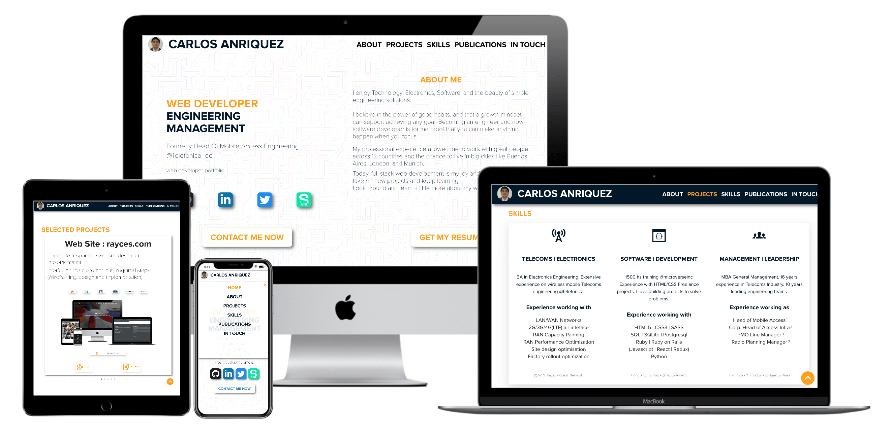

# Personal Portfolio Page

> Portfolio web-app to display main contact details and my work selection.

Build-in Ruby on Rails with the ultimate aim to include further backend services.

- Release v0.1: 22/06/2020. Full responsive HTML page for project and contact point display.
- Release v0.5: (exp. end of July 2020). Adding a Twitter Bot API to search and store my tweets. Bot running on crontab at the server. The main app would consume the latest tweets to display on the main page as a new section.
- Release v1.0: (exp. end of August 2020). Adding job search scraper on key webpages. Visitors could register themselves to receive weekly updates about jobs and my latest articles.

## Built With

- Ruby, Javascript, HTML/CSS/SCSS, ERB. 
- Rails
- AWS EC2 Instance running in production.
- VS Code

## Live Demo

[Live Demo Link: carlosanriquez.com](https://www.carlosanriquez.com)

## Authors

👤 ***Carlos Anriquez***

- Github: [@canriquez](https://github.com/canriquez)
- Twitter: [@cranriquez](https://twitter.com/cranriquez)
- Linkedin: [linkedin](https://www.linkedin.com/in/carlosanriquez/)

## 🤝 Contributing

Contributions, issues, and feature requests are welcome!

Feel free to check the [issues page](issues/).

## Show your support

Give a ⭐️ if you like this project!

## Acknowledgments

- Microverse
- My Family!
